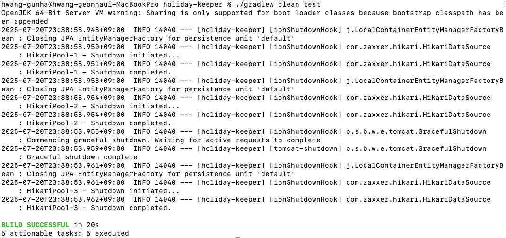

## 1) 빌드 & 실행 방법

```bash
# 빌드
./gradlew clean build

# 실행
./gradlew bootRun

```

## 2) 설계한 REST API 명세 요약

### 데이터 적재  `POST /api/v1/holidays`

최근 5년(2020~2025)의 공휴일을 외부 API에서 수집하여 저장합니다.

- **응답 예시**

```json
{
    "meta": {
        "result": "SUCCESS",
        "errorCode": null,
        "message": null
    },
    "data": {
        "loads": [
            {
                "countryCode": "AD",
                "holidayCount": 84
            },
            {
                "countryCode": "AL",
                "holidayCount": 84
            },
            {
                "countryCode": "AM",
                "holidayCount": 84
            }
            ...
        ]
    }
}
```

### 공휴일 검색 `GET /api/v1/holidays`

연도별 및 국가별 기반으로 공휴일을 조회합니다.

- **조회 쿼리 파라미터**

| **파라미터** | **예시** | **설명** |
| --- | --- | --- |
| `countryCode` | `KR` | 특정 나라 코드 |
| `year` | `2025` | 특정 연도 |
| `page`  | `0` | 페이지 번호 |
| `size`  | `10` | 페이지당 공휴일 수 (기본값 10) |
| `sort` | `DATE_ASC` | 정렬 조건 (기본값 DATE_ASC) |
- **응답 예시**

```json
{
    "meta": {
        "result": "SUCCESS",
        "errorCode": null,
        "message": null
    },
    "data": {
        "countryCode": "KR",
        "pagination": {
            "page": 0,
            "size": 10,
            "totalCount": 15,
            "totalPages": 2
        },
        "holidays": [
            {
                "name": "New Year's Day",
                "description": "새해",
                "date": "2025-01-01"
            },
            {
                "name": "Lunar New Year",
                "description": "설날",
                "date": "2025-01-28"
            },
            {
                "name": "Lunar New Year",
                "description": "설날",
                "date": "2025-01-29"
            },
            {
                "name": "Lunar New Year",
                "description": "설날",
                "date": "2025-01-30"
            },
            {
                "name": "Independence Movement Day",
                "description": "3·1절",
                "date": "2025-03-01"
            },
            {
                "name": "Children's Day",
                "description": "어린이날",
                "date": "2025-05-05"
            },
            {
                "name": "Buddha's Birthday",
                "description": "부처님 오신 날",
                "date": "2025-05-05"
            },
            {
                "name": "Memorial Day",
                "description": "현충일",
                "date": "2025-06-06"
            },
            {
                "name": "Liberation Day",
                "description": "광복절",
                "date": "2025-08-15"
            },
            {
                "name": "National Foundation Day",
                "description": "개천절",
                "date": "2025-10-03"
            }
        ]
    }
}
```

## 공휴일 재동기화 `PATCH /api/v1/holidays/{year}/{countryCode}`

특정 연도 및 국가 데이터를 재호출하여 덮어씁니다.

- **응답 예시**

```json
{
  "meta": {
    "result": "SUCCESS",
    "errorCode": null,
    "message": null
  },
  "data": {
    "countryCode": "KR",
    "year": 2025,
    "refreshedCount": 3,
    "refreshedHolidays": [
      {
        "name": "Lunar New Year",
        "description": "설날",
        "date": "2025-01-28"
      },
      {
        "name": "Lunar New Year",
        "description": "설날",
        "date": "2025-01-29"
      },
      {
        "name": "Lunar New Year",
        "description": "설날",
        "date": "2025-01-30"
      }
    ]
  }
}

```

### 삭제 `api/v1/holidays/{year}/{countryCode}`

특정 연도 및 국가의 공휴일 데이터를 삭제합니다.

- **응답 예시**

```json
{
  "meta": {
    "result": "SUCCESS",
    "errorCode": null,
    "message": null
  },
  "data": {
    "countryCode": "KR",
    "year": 2025,
    "deletedCount": 2
  }
}

```


## 3) ./gradlew clean test 성공 스크린샷


## 4) Swagger UI 또는 OpenAPI JSON 노출 확인 방법

- **Swagger UI**

  http://localhost:8080/swagger-ui.html